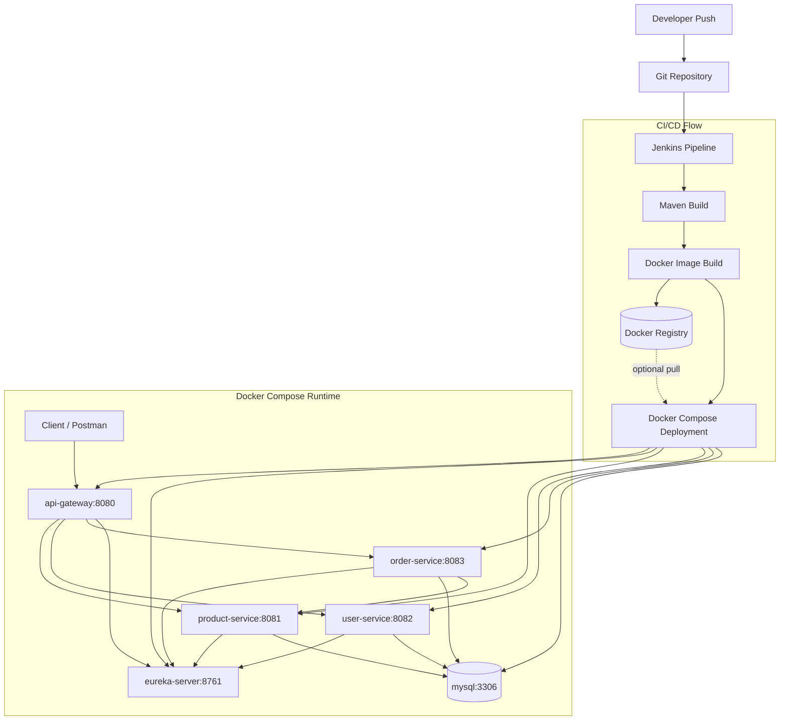

# Spring Boot eCommerce Backend Microservices

## Overview
This repository contains a Spring Boot microservices backend for an eCommerce system. The services are packaged as Docker images, orchestrated with Docker Compose, and prepared for CI/CD with Jenkins.

Services in this repository:

- **Eureka Server**: service discovery
- **API Gateway**: entry point for external traffic
- **Product Service**: product and stock management
- **User Service**: user management
- **Order Service**: order processing with product lookup
- **MySQL**: shared relational database used by the business services

## Application Architecture
```text
+-------------+       +------------------+
|   Client    | ----> |   API Gateway    |
+-------------+       +--------+---------+
                               |
               +---------------+----------------+
               |               |                |
               v               v                v
        +-------------+  +-------------+  +-------------+
        | Product     |  | User        |  | Order       |
        | Service     |  | Service     |  | Service     |
        +------+------+  +------+------+  +------+------+
               |                |                |
               +----------------+----------------+
                                |
                                v
                         +-------------+
                         |    MySQL    |
                         +-------------+

All services register with Eureka Server.
Order Service also calls Product Service during order placement.
```

## Deployment Architecture Diagram


## Container Topology

| Component | Port | Purpose |
| --- | --- | --- |
| API Gateway | 8080 | External API entry point |
| Eureka Server | 8761 | Service registration and discovery |
| Product Service | 8081 | Product and inventory APIs |
| User Service | 8082 | User APIs |
| Order Service | 8083 | Order APIs |
| MySQL | 3306 | Shared database |

## Tech Stack

- Java 21
- Spring Boot 3
- Spring Cloud Gateway
- Spring Cloud Netflix Eureka
- Spring Data JPA
- Spring WebFlux
- MySQL 8
- Docker and Docker Compose
- Jenkins
- Maven Wrapper

## Deployment Flow

1. Jenkins checks out the code.
2. Maven builds the services.
3. Docker images are built for each service.
4. Images can be pushed to a Docker registry.
5. Docker Compose deploys the full stack.

## Prerequisites

- Java 21
- Docker
- Docker Compose
- Jenkins with Docker access for CI/CD

## Run Locally With Docker Compose
```sh
docker compose up --build
```

Stop the stack:
```sh
docker compose down
```

## CI/CD Pipeline
The repository includes a Jenkins pipeline in [Jenkinsfile](/media/chamika/1.0%20TB%20Hard%20Disk2/springboot-ecommerce-backend-microservices/Jenkinsfile) with these stages:

- Checkout source code
- Build Maven artifacts
- Build Docker images
- Push images to a registry when Docker credentials are configured
- Deploy with Docker Compose when `DEPLOY_WITH_COMPOSE=true`

Optional Jenkins environment variables:

- `DOCKER_REGISTRY`
- `IMAGE_NAMESPACE`
- `DOCKER_CREDENTIALS_ID`
- `DEPLOY_WITH_COMPOSE`

## Docker Files
Each service has its own Dockerfile:

- [Eureka-server/Dockerfile](/media/chamika/1.0%20TB%20Hard%20Disk2/springboot-ecommerce-backend-microservices/Eureka-server/Dockerfile)
- [api-gateway/Dockerfile](/media/chamika/1.0%20TB%20Hard%20Disk2/springboot-ecommerce-backend-microservices/api-gateway/Dockerfile)
- [product-service/Dockerfile](/media/chamika/1.0%20TB%20Hard%20Disk2/springboot-ecommerce-backend-microservices/product-service/Dockerfile)
- [user-service/Dockerfile](/media/chamika/1.0%20TB%20Hard%20Disk2/springboot-ecommerce-backend-microservices/user-service/Dockerfile)
- [order-service/Dockerfile](/media/chamika/1.0%20TB%20Hard%20Disk2/springboot-ecommerce-backend-microservices/order-service/Dockerfile)

Compose orchestration is defined in [docker-compose.yml](/media/chamika/1.0%20TB%20Hard%20Disk2/springboot-ecommerce-backend-microservices/docker-compose.yml).

## Notes

- `order-service` depends on `product-service` both at runtime and during Maven packaging.
- The services now support container-friendly configuration through environment variables instead of hardcoded `localhost` values.
- MySQL credentials in the compose file are currently repository-local defaults and should be replaced for real deployments.

## License
This project is open-source and available under the **MIT License**.
